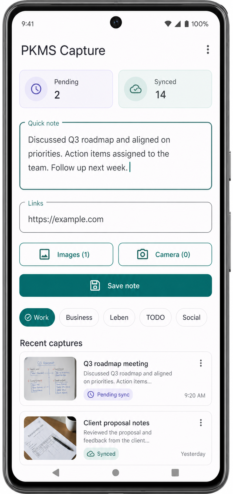

# PKMS Obsi

Local-first personal knowledge capture for Android and Obsidian.



The project has two main parts:

- `app/`: Android app built with Kotlin, Jetpack Compose, Room, WorkManager, and OkHttp.
- `backend/PkmsBackend/`: Spring Boot backend that writes synced captures into an Obsidian Inbox.

## What Is In Git

The repository tracks the source code, Gradle wrapper, Maven wrapper scripts, Android resources, backend configuration templates, OpenSpec planning files, and the app mockup image. Generated build outputs, local vault data, sync indexes, IDE workspace files, and Codex-local skills are intentionally ignored.

From a fresh clone, the first build downloads Gradle, Maven, Android, and Spring dependencies from their normal public repositories.

## Prerequisites

- Git
- Android Studio with the Android SDK installed
- JDK 25 for the Spring Boot backend
- A network connection for the first dependency download
- Optional: Obsidian, with an Inbox folder configured for the backend output

## Common Workflow

Start the backend:

```powershell
cd backend\PkmsBackend
.\mvnw.cmd spring-boot:run
```

Build a debug APK for the Android emulator:

```powershell
cd app
.\gradlew.bat assembleDebug
```

Build a debug APK for a real phone on the same Wi-Fi as the laptop:

```powershell
cd app
.\gradlew.bat assembleDebug -PpkmsBackendBaseUrl=http://192.168.0.218:8080
```

Replace `192.168.0.218` with the laptop's current IPv4 address. On Windows, `ipconfig` shows it under the active Wi-Fi/Ethernet adapter.

The debug APK is written to:

```text
app\app\build\outputs\apk\debug\app-debug.apk
```

Open the Android app in Android Studio by opening the `app/` folder. The checked-in Gradle wrapper and version catalog are enough for Android Studio to sync the project.

## Verification

Run backend tests:

```powershell
cd backend\PkmsBackend
.\mvnw.cmd test
```

Run the Android build, unit tests, and lint:

```powershell
cd app
.\gradlew.bat build
```

## Important Configuration

Android backend URL:

```powershell
-PpkmsBackendBaseUrl=http://<laptop-ip>:8080
```

Backend Vault properties:

```properties
pkms.vault.inbox-path=./vault/Inbox
pkms.vault.attachment-directory=_attachments
pkms.sync.index-path=./data/synced-captures.properties
```

Production backend overrides live in:

```text
backend\PkmsBackend\src\main\resources\application-prod.properties
```

For a different Obsidian Inbox, change the `pkms.vault.*` properties or provide Spring Boot overrides at runtime. The default backend paths create local `vault/` and `data/` folders under `backend/PkmsBackend/`; those folders are runtime data and are not committed.

## Capture Behavior

The Android app can save captures offline with text, links, images, camera photos, and optional categories. Pending captures sync automatically through WorkManager when the backend is reachable.

Synced Obsidian Markdown frontmatter intentionally contains only:

```yaml
created_at: "..."
synced_at: "..."
```

Internal capture IDs are still used for duplicate protection, but they are not written as visible Markdown frontmatter.
